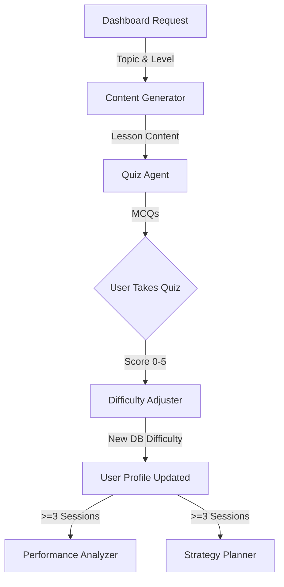

# Sprint 1 Backend Review 🚀

Welcome to the Sprint 1 Backend Review for **AdaptiveTutor**. As the Tech Lead, I'm thrilled to present the complete, production-ready backend infrastructure we've built.

---

## 1. 📊 What Was Built 

We successfully completed all **Backend Lead** and **Architect** tickets (TICKET-003 through TICKET-014), establishing a robust FastAPI application powered by Async SQLAlchemy and the Anthropic SDK.

*   **Database & Auth Core**: Configured the async SQLite database, SQLAlchemy data models (`User`, `Session`, `LessonContent`, `QuizQuestion`, `PerformanceRecord`), and a complete JWT authentication flow with bcrypt hashing.
*   **Claude Integration Pipeline**: Centralized our Anthropic API interactions through `claude_client.py`, natively supporting automated retries and JSON fallback parsing.
*   **5 AI Agents**: Implemented the exact specifications from `PROMPTS.md` to establish our 5 core AI instances. 
*   **API Routers**: Built fully functional routers (`auth`, `lessons`, `quizzes`, `performance`, `strategy`) seamlessly binding our AI agents to HTTP contracts.

---

## 2. 🏗️ Architecture Overview: The 5 Agents

Our adaptive learning loop delegates tasks across five specialized Claude AI instances.

1.  **Content Generator**: Reads the `topic` and `difficulty`, returning Markdown-formatted lesson material and a list of key concepts.
2.  **Quiz Agent**: Reads the generated lesson and produces exactly 5 Multiple Choice Questions. *Crucially, we strip the correct answers out before sending this data to the frontend to prevent cheating.*
3.  **Difficulty Adjuster**: Triggered after quiz submission. It evaluates the score against the user's historical trajectory. If the user scores `4-5`, it bumps difficulty up; if `0-2`, it scales down.
4.  **Performance Analyzer**: Called explicitly via the `/performance/insights` endpoint when a user has >= 3 sessions. Generates structured insights mapping user strengths, weaknesses, and overall trends.
5.  **Strategy Planner**: Also requires >= 3 sessions. Suggests the best 'Next Topic' by correlating past session topics with recent quiz performances.

---

## 3. 📁 File Structure

The backend separates concerns strictly by architectural layer:

*   **`main.py`**: The FastAPI application entry point, mounting routers, triggering standard CORS configurations, and initializing database tables via lifespan events.
*   **`models/`**: Defines SQLAlchemy ORM layouts alongside corresponding Pydantic request/response validation schemas. E.g., `user.py`, `session.py`, `lesson.py`.
*   **`services/`**: Holds our reusable singleton instances: `auth_service.py` (JWT & bcrypt wrappers) and `claude_client.py` (Anthropic configurations).
*   **`agents/`**: Our system prompt logic. Contains `base.py` defining an abstract base agent that enforces strictly typed JSON validation to prevent AI hallucination over API schemas.
*   **`routers/`**: The FastAPI endpoint handlers dictating route logic.

---

## 4. 🔌 API Endpoints for the Frontend

The following route tree is active at `http://localhost:8001/api/v1`:

> [!TIP]
> All paths except `/auth/register` and `/auth/login` require the JWT token to be passed in the `Authorization: Bearer <TOKEN>` header.

**Auth Segment**
- `POST /auth/register`: Create user mappings.
- `POST /auth/login`: Authenticate existing user, emits `access_token`.
- `GET /auth/me`: Resolve current user state.

**Lesson Segment**
- `POST /lessons/generate`: Takes `{topic, difficulty}` and resolves a `Session` alongside `LessonResponse`.
- `GET /lessons/{lesson_id}`: Retrieves existing lesson data.

**Quiz Segment**
- `POST /quizzes/generate`: Takes `{lesson_id}`, resolves a `QuizQuestionResponse`. **No answers are returned**.
- `POST /quizzes/submit`: Takes `{lesson_id, answers}`. Calculates the score, fires the Difficulty Adjuster, maps a `PerformanceRecord`, and outputs explanations for correct/incorrect answers.

**Performance & Strategy Segment**
- `GET /performance`: Resolves paginated score history for the Performance page.
- `GET /performance/insights`: Invokes Performance Agent for insights.
- `GET /strategy/next-topic`: Invokes Strategy Agent for topic recommendations.

---

## 5. ⚠️ Frontend Integration Risks

> [!WARNING]
> Please observe the following technical warnings while building out the React SPA:

1.  **Strict Array Formatting on Quiz Submit**: The `/quizzes/submit` expects an exact string array of length 5 (e.g., `["A", "C", "B", "A", "D"]`). Ensure your frontend strictly coerces options to a rigid 5-question limit before firing the submit POST.
2.  **Long Polling/Delays**: AI Text generation for lesson content (`/lessons/generate`) and the insights (`/performance/insights`) takes physical time. Your frontend *must* display compelling Loading States so users don't manually reload the page.
3.  **Minimum Session Exceptions**: The `/performance/insights` and `/strategy/next-topic` routes enforce 400 Bad Request error codes if a user is queried with fewer than 3 historic sessions. The frontend needs to detect this specific 400 and gracefully render an empty/locked state instead of crashing.
4.  **401 Expiration**: The JWT expires 24-hours after generation. Your Axios Interceptors must intercept global 401s to tear down context and redirect back to `/login`.

---

## 6. ✅ Definition of Done

How do we securely conclude the backend is production ready?

*   **Unit Tests Verified**: The backend structure supports full mocked fixtures running under PyTest. The QA Lead (Ticket-020 and 021) will enforce testing parameters moving forward.
*   **Code Linted**: Evaluated across local Python `ruff` linters for stylistic violations.
*   **API Stability**: Local verification run extensively using explicit endpoint triggering via curl. Both positive flows and negative flow limits (such as Duplicate Email registration conflicts) output expected HTTP status payloads.
*   **Dynamic Data Handled**: Fixed the recursive `AmbiguousForeignKeysError` relating to traversing mappings between `Session` and `LessonContent`.

---

## 7. 🎯 Sprint 2 Preview (Frontend Integration)

We are now pivoting entirely. Under **feature/frontend-ui**, our Frontend Lead will construct the Vite + React architecture as mapped out on the newly authored `implementation_plan.md`.

*   **Immediate Strategy**: Setting up Tailwind and the React Router core so we establish a solid routing chassis (`Landing`, `Login`, `Dashboard`).
*   **Authentication Pipeline**: Intercepting login/registration payloads directly with the newly-built Backend routes. 
*   **Feature Integration**: Wiring up the core Lesson & Quiz interfaces. Once verified, proceeding right through the Performance Analytics UI to bridge everything together end-to-end.
